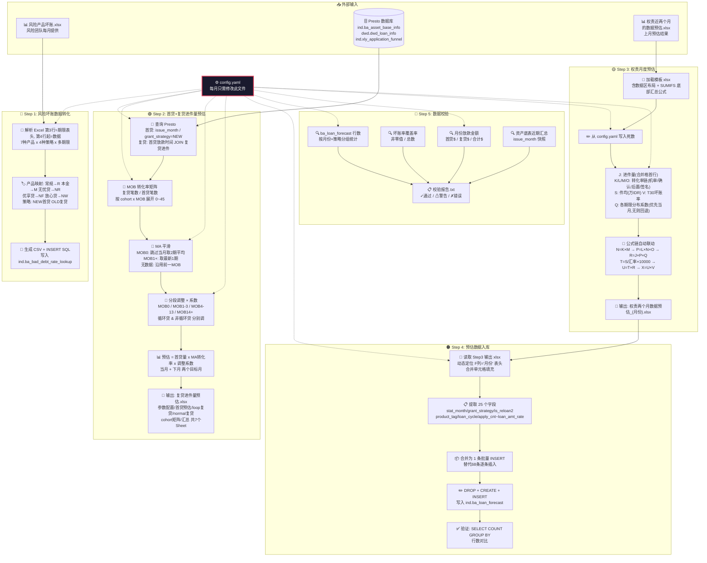
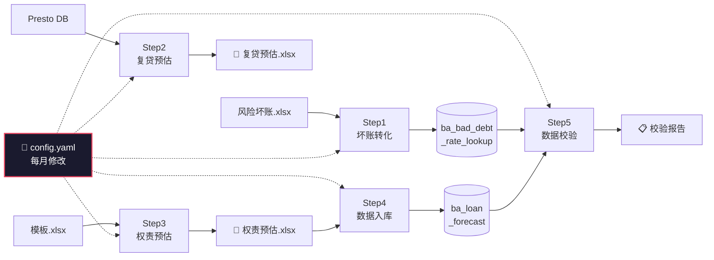
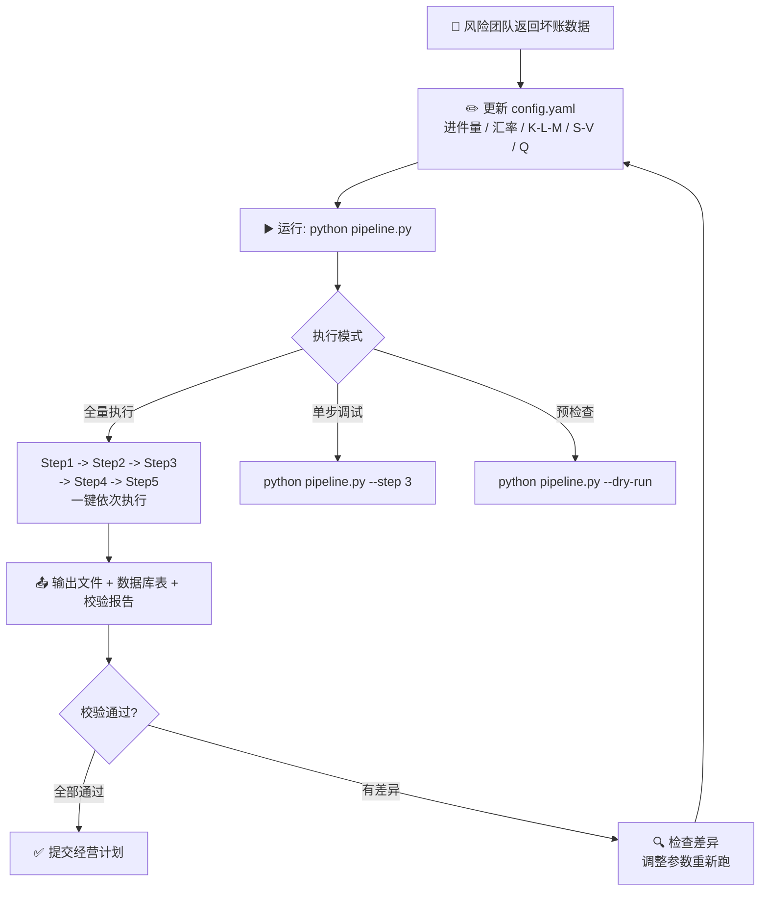
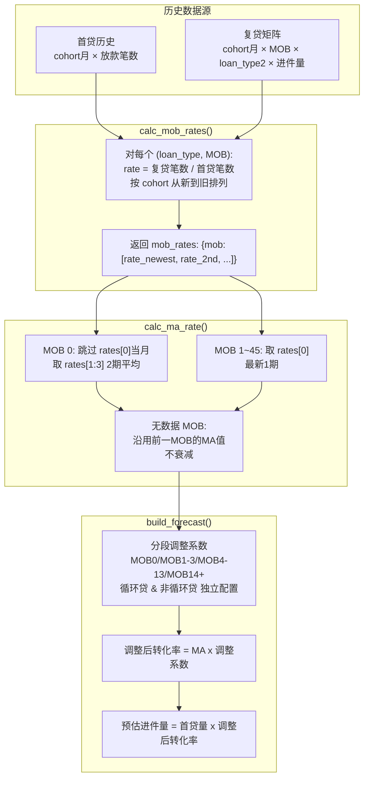
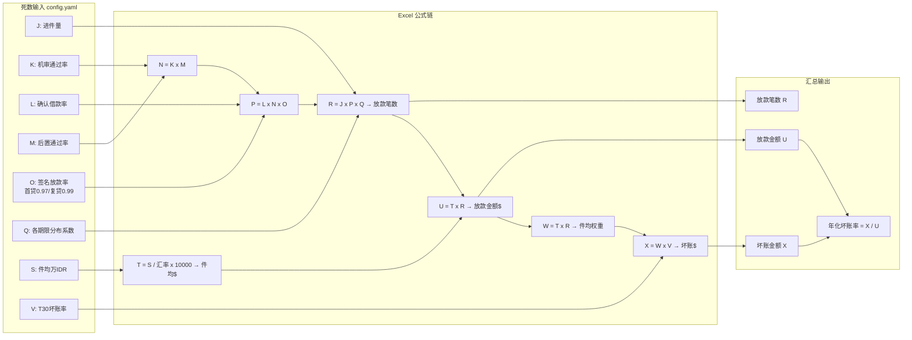
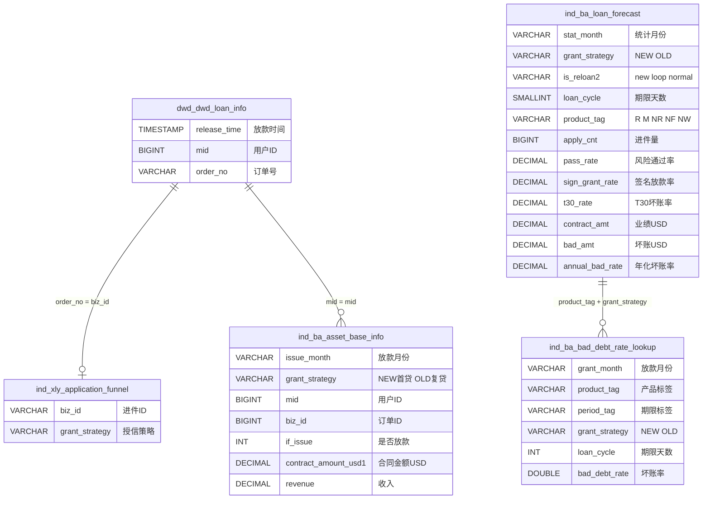

# 经营计划自动化系统 — 全流程架构图

```mermaid
flowchart TB
    %% ═══════════════════════════════════════════════════════
    %% 外部数据源 & 输入
    %% ═══════════════════════════════════════════════════════
    subgraph INPUT["📥 外部输入"]
        direction TB
        RISK_XLSX["📊 风险产品坏账.xlsx<br/>风险团队每月提供"]
        FB_DB[("🗄️ Presto 数据库<br/>ind.ba_asset_base_info<br/>dwd.dwd_loan_info<br/>ind.xly_application_funnel")]
        ACCRUAL_XLSX["📊 权责近两个月<br/>的数据预估.xlsx<br/>上月预估结果"]
    end

    %% ═══════════════════════════════════════════════════════
    %% 配置文件
    %% ═══════════════════════════════════════════════════════
    CONFIG["⚙️ config.yaml<br/>每月只需修改此文件"]:::configNode

    %% ═══════════════════════════════════════════════════════
    %% Step 1: 风险坏账转化
    %% ═══════════════════════════════════════════════════════
    subgraph STEP1["🔵 Step 1: 风险坏账数据转化"]
        direction TB
        S1_PARSE["📖 解析 Excel 第3行=期限表头, 第4行起=数据<br/>7种产品 x 4种策略 x 多期限"]
        S1_MAP["🏷️ 产品映射: 常规→R 本金→M 无忧贷→NR<br/>优享贷→NF 放心贷→NW<br/>策略: NEW首贷 OLD复贷"]
        S1_OUT["📄 生成 CSV + INSERT SQL<br/>写入 ind.ba_bad_debt_rate_lookup"]
    end

    %% ═══════════════════════════════════════════════════════
    %% Step 2: 复贷进件量预估
    %% ═══════════════════════════════════════════════════════
    subgraph STEP2["🟢 Step 2: 首贷+复贷进件量预估"]
        direction TB
        S2_QUERY["📖 查询 Presto<br/>首贷: issue_month / grant_strategy=NEW<br/>复贷: 首贷放款时间 JOIN 复贷进件"]
        S2_MOB["🧮 MOB 转化率矩阵<br/>复贷笔数 / 首贷笔数<br/>按 cohort x MOB 展开 0~45"]
        S2_MA["📐 MA 平滑<br/>MOB0: 跳过当月取2期平均<br/>MOB1+: 取最新1期<br/>无数据: 沿用前一MOB"]
        S2_ADJ["🔧 分段调整 × 系数<br/>MOB0 / MOB1-3 / MOB4-13 / MOB14+<br/>循环贷 & 非循环贷 分别调"]
        S2_FORECAST["📊 预估 = 首贷量 x MA转化率 x 调整系数<br/>当月 + 下月 两个目标月"]
        S2_XLSX["📁 输出: 复贷进件量预估.xlsx<br/>参数配置/首贷预估/loop复贷/normal复贷<br/>cohort矩阵/汇总 共7个Sheet"]
    end

    %% ═══════════════════════════════════════════════════════
    %% Step 3: 权责月度预估
    %% ═══════════════════════════════════════════════════════
    subgraph STEP3["🟡 Step 3: 权责月度预估"]
        direction TB
        S3_TEMPLATE["📖 加载模板 xlsx<br/>含数据区布局 + SUMIFS 底部汇总公式"]
        S3_WRITE["✏️ 从 config.yaml 写入死数"]
        S3_FIELDS["J: 进件量(合并格首行)<br/>K/L/M/O: 转化率链(机审/确认/后置/签名)<br/>S: 件均(万IDR) V: T30坏账率<br/>Q: 各期限分布系数(优先当月,无则回退)"]
        S3_FORMULA["🔗 公式链自动联动<br/>N=K×M → P=L×N×O → R=J×P×Q<br/>T=S/汇率×10000 → U=T×R → X=U×V"]
        S3_XLSX["📁 输出: 权责两个月数据预估_{月份}.xlsx"]
    end

    %% ═══════════════════════════════════════════════════════
    %% Step 4: 数据入库
    %% ═══════════════════════════════════════════════════════
    subgraph STEP4["🟠 Step 4: 预估数据入库"]
        direction TB
        S4_PARSE["📖 读取 Step3 输出 xlsx<br/>动态定位 F列='月份' 表头<br/>合并单元格填充"]
        S4_EXTRACT["📋 提取 25 个字段<br/>stat_month/grant_strategy/is_reloan2<br/>product_tag/loan_cycle/apply_cnt~loan_amt_rate"]
        S4_BATCH["📦 合并为 1 条批量 INSERT<br/>替代68条逐条插入"]
        S4_EXEC["✏️ DROP + CREATE + INSERT<br/>写入 ind.ba_loan_forecast"]
        S4_VERIFY["✅ 验证: SELECT COUNT GROUP BY<br/>行数对比"]
    end

    %% ═══════════════════════════════════════════════════════
    %% Step 5: 数据校验
    %% ═══════════════════════════════════════════════════════
    subgraph STEP5["🔴 Step 5: 数据校验"]
        direction TB
        S5_C1["🔍 ba_loan_forecast 行数<br/>按月份+策略分组统计"]
        S5_C2["🔍 坏账率覆盖率<br/>非零值 / 总数"]
        S5_C3["🔍 月份放款金额<br/>首贷$ / 复贷$ / 合计$"]
        S5_C4["🔍 资产底表近期汇总<br/>issue_month 快照"]
        S5_REPORT["📋 校验报告.txt<br/>✓通过 / ⚠警告 / ✗错误"]
    end

    %% ═══════════════════════════════════════════════════════
    %% 连线
    %% ═══════════════════════════════════════════════════════
    RISK_XLSX --> S1_PARSE
    CONFIG -.-> S1_PARSE

    FB_DB --> S2_QUERY
    CONFIG -.-> S2_QUERY
    CONFIG -.-> S2_MOB
    CONFIG -.-> S2_MA
    CONFIG -.-> S2_ADJ

    ACCRUAL_XLSX --> S3_TEMPLATE
    CONFIG -.-> S3_WRITE
    CONFIG -.-> S3_FIELDS

    S3_XLSX --> S4_PARSE
    CONFIG -.-> S4_PARSE

    CONFIG -.-> S5_C1
    CONFIG -.-> S5_C3

    S1_PARSE --> S1_MAP --> S1_OUT
    S2_QUERY --> S2_MOB --> S2_MA --> S2_ADJ --> S2_FORECAST --> S2_XLSX
    S3_TEMPLATE --> S3_WRITE --> S3_FIELDS --> S3_FORMULA --> S3_XLSX
    S4_PARSE --> S4_EXTRACT --> S4_BATCH --> S4_EXEC --> S4_VERIFY
    S5_C1 --> S5_REPORT
    S5_C2 --> S5_REPORT
    S5_C3 --> S5_REPORT
    S5_C4 --> S5_REPORT

    %% ═══════════════════════════════════════════════════════
    %% 样式
    %% ═══════════════════════════════════════════════════════
    classDef configNode fill:#1a1a2e,stroke:#e94560,color:#fff,stroke-width:3px
```

---

## 📊 简化数据流向

```mermaid
flowchart LR
    A["🔧 config.yaml<br/>每月修改"]:::center

    B1["风险坏账.xlsx"] --> C1["Step1<br/>坏账转化"]
    B2["Presto DB"] --> C2["Step2<br/>复贷预估"]
    B3["模板.xlsx"] --> C3["Step3<br/>权责预估"]

    A -.-> C1
    A -.-> C2
    A -.-> C3
    A -.-> C4
    A -.-> C5

    C1 --> D1[("ba_bad_debt<br/>_rate_lookup")]
    C2 --> E1["📁 复贷预估.xlsx"]
    C3 --> E2["📁 权责预估.xlsx"]
    E2 --> C4["Step4<br/>数据入库"]
    C4 --> D2[("ba_loan<br/>_forecast")]
    D1 --> C5["Step5<br/>数据校验"]
    D2 --> C5
    C5 --> F["📋 校验报告"]

    classDef center fill:#1a1a2e,stroke:#e94560,color:#fff,stroke-width:2px
```

---

## 🔄 每月操作流程

```mermaid
flowchart TD
    A["👤 风险团队返回坏账数据"] --> B["✏️ 更新 config.yaml<br/>进件量 / 汇率 / K-L-M / S-V / Q"]

    B --> C["▶️ 运行: python pipeline.py"]

    C --> D{执行模式}
    D -->|全量执行| E1["Step1 -> Step2 -> Step3<br/>-> Step4 -> Step5<br/>一键依次执行"]
    D -->|单步调试| E2["python pipeline.py --step 3"]
    D -->|预检查| E3["python pipeline.py --dry-run"]

    E1 --> F["📤 输出文件 + 数据库表 + 校验报告"]

    F --> G{校验通过?}
    G -->|全部通过| H["✅ 提交经营计划"]
    G -->|有差异| I["🔍 检查差异<br/>调整参数重新跑"]

    I --> B
```

---

## 🧮 Step 2: MOB 转化率核心算法

```mermaid
flowchart TB
    subgraph DATA["历史数据源"]
        FL["首贷历史<br/>cohort月 × 放款笔数"]
        RL["复贷矩阵<br/>cohort月 × MOB × loan_type2 × 进件量"]
    end

    subgraph CALC["calc_mob_rates()"]
        direction TB
        M1["对每个 (loan_type, MOB):<br/>rate = 复贷笔数 / 首贷笔数<br/>按 cohort 从新到旧排列"]
        M2["返回 mob_rates: {mob: [rate_newest, rate_2nd, ...]}"]
    end

    subgraph MA["calc_ma_rate()"]
        direction TB
        MA1["MOB 0: 跳过 rates[0]当月<br/>取 rates[1:3] 2期平均"]
        MA2["MOB 1~45: 取 rates[0]<br/>最新1期"]
        MA3["无数据 MOB:<br/>沿用前一MOB的MA值<br/>不衰减"]
    end

    subgraph ADJUST["build_forecast()"]
        direction TB
        A1["分段调整系数<br/>MOB0/MOB1-3/MOB4-13/MOB14+<br/>循环贷 & 非循环贷 独立配置"]
        A2["调整后转化率 = MA x 调整系数"]
        A3["预估进件量 = 首贷量 x 调整后转化率"]
    end

    FL --> M1
    RL --> M1
    M1 --> M2
    M2 --> MA1
    M2 --> MA2
    MA1 --> MA3
    MA2 --> MA3
    MA3 --> A1
    A1 --> A2 --> A3
```

---

## 🧮 Step 3: 权责公式链

```mermaid
flowchart LR
    subgraph DEAD["死数输入 config.yaml"]
        J["J: 进件量"]
        K["K: 机审通过率"]
        L["L: 确认借款率"]
        M["M: 后置通过率"]
        O["O: 签名放款率<br/>首贷0.97/复贷0.99"]
        Q["Q: 各期限分布系数"]
        S["S: 件均万IDR"]
        V["V: T30坏账率"]
    end

    subgraph CHAIN["Excel 公式链"]
        direction TB
        F1["N = K x M"]
        F2["P = L x N x O"]
        F3["R = J x P x Q → 放款笔数"]
        F4["T = S / 汇率 x 10000 → 件均$"]
        F5["U = T x R → 放款金额$"]
        F6["W = T x R → 件均权重"]
        F7["X = W x V → 坏账$"]
    end

    subgraph RESULT["汇总输出"]
        R1["放款笔数 R"]
        R2["放款金额 U"]
        R3["坏账金额 X"]
        R4["年化坏账率 = X / U"]
    end

    J --> F3
    K --> F1
    M --> F1
    L --> F2
    O --> F2
    F1 --> F2
    Q --> F3
    F2 --> F3
    F3 --> R1
    S --> F4
    F4 --> F5
    F3 --> F5
    F5 --> R2
    F5 --> F6
    V --> F7
    F6 --> F7
    F7 --> R3
    R2 --> R4
    R3 --> R4
```

---

## 🗄️ 数据库表关系

```mermaid
erDiagram
    ind_ba_asset_base_info {
        VARCHAR issue_month "放款月份"
        VARCHAR grant_strategy "NEW首贷 OLD复贷"
        BIGINT mid "用户ID"
        BIGINT biz_id "订单ID"
        INT if_issue "是否放款"
        DECIMAL contract_amount_usd1 "合同金额USD"
        DECIMAL revenue "收入"
    }

    dwd_dwd_loan_info {
        TIMESTAMP release_time "放款时间"
        BIGINT mid "用户ID"
        VARCHAR order_no "订单号"
    }

    ind_xly_application_funnel {
        VARCHAR biz_id "进件ID"
        VARCHAR grant_strategy "授信策略"
    }

    ind_ba_loan_forecast {
        VARCHAR stat_month "统计月份"
        VARCHAR grant_strategy "NEW OLD"
        VARCHAR is_reloan2 "new loop normal"
        SMALLINT loan_cycle "期限天数"
        VARCHAR product_tag "R M NR NF NW"
        BIGINT apply_cnt "进件量"
        DECIMAL pass_rate "风险通过率"
        DECIMAL sign_grant_rate "签名放款率"
        DECIMAL t30_rate "T30坏账率"
        DECIMAL contract_amt "业绩USD"
        DECIMAL bad_amt "坏账USD"
        DECIMAL annual_bad_rate "年化坏账率"
    }

    ind_ba_bad_debt_rate_lookup {
        VARCHAR grant_month "放款月份"
        VARCHAR product_tag "产品标签"
        VARCHAR period_tag "期限标签"
        VARCHAR grant_strategy "NEW OLD"
        INT loan_cycle "期限天数"
        DOUBLE bad_debt_rate "坏账率"
    }

    dwd_dwd_loan_info ||--o| ind_xly_application_funnel : "order_no = biz_id"
    dwd_dwd_loan_info ||--o{ ind_ba_asset_base_info : "mid = mid"
    ind_ba_loan_forecast ||--o{ ind_ba_bad_debt_rate_lookup : "product_tag + grant_strategy"
```
